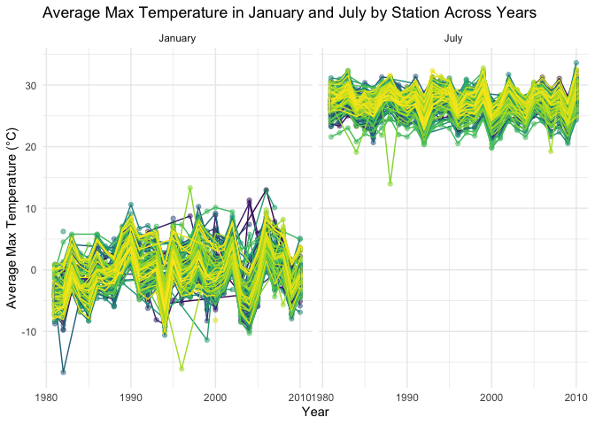
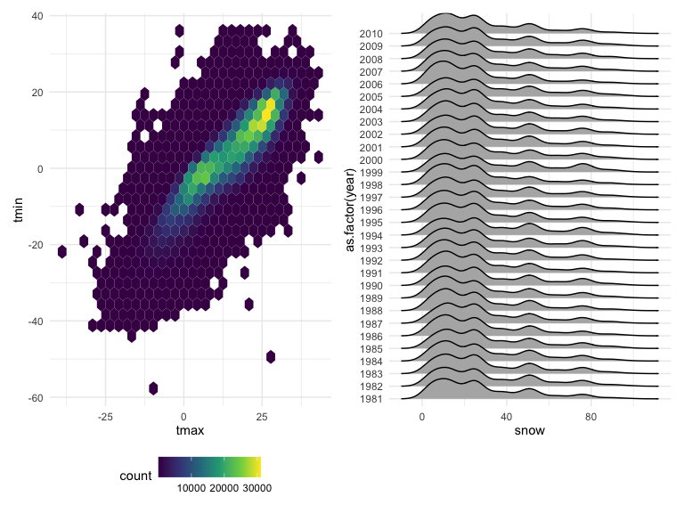

Homework3
================
Avery Wang
2024-10-12

## Problem 1

Load the package and set up r

``` r
library(tidyverse)
```

    ## ── Attaching core tidyverse packages ──────────────────────── tidyverse 2.0.0 ──
    ## ✔ dplyr     1.1.4     ✔ readr     2.1.5
    ## ✔ forcats   1.0.0     ✔ stringr   1.5.1
    ## ✔ ggplot2   3.5.1     ✔ tibble    3.2.1
    ## ✔ lubridate 1.9.3     ✔ tidyr     1.3.1
    ## ✔ purrr     1.0.2     
    ## ── Conflicts ────────────────────────────────────────── tidyverse_conflicts() ──
    ## ✖ dplyr::filter() masks stats::filter()
    ## ✖ dplyr::lag()    masks stats::lag()
    ## ℹ Use the conflicted package (<http://conflicted.r-lib.org/>) to force all conflicts to become errors

``` r
library(ggridges)
library(p8105.datasets)
library(patchwork)
knitr::opts_chunk$set(
    echo = TRUE,
    warning = FALSE,
    fig.width = 8,
  fig.height = 6,
  out.width = "90%"
)

theme_set(theme_minimal() + theme(legend.position = "bottom"))

options(
  ggplot2.continuous.colour = "viridis",
  ggplot2.continuous.fill = "viridis"
)

scale_colour_discrete = scale_colour_viridis_d
scale_fill_discrete = scale_fill_viridis_d
```

Load dataset

``` r
data("ny_noaa")
```

This dataset contains 2595176 rows and 7 columns. It includes variables
id, date, prcp (precipitation), snow (snowfall), snwd (snow depth), tmax
and tmin (the max and min of temperature). It is also observed that the
missing data frequently appears in the dataset especially in column tmax
and tmin, which are important columns. So the first step of the data
cleaning is to drop the rows with the missing values.

Then the year, month and day values are extracted using `lubridate`. And
since the current prcp, tmax and tmax are tenths of mm and degrees C,
these columns should be divided by 10. For tmax and tmin, the type
should be converted to numeric first to do the calculation.

``` r
cleaned_noaa= ny_noaa |> drop_na() |>
  #seperate year,month and date
  mutate(year=lubridate::year(date), # extract year
         month=lubridate::month(date), #extract month
         day = lubridate::day(date),#extract day
         prcp = prcp / 10,
         tmax=as.numeric(tmax), #convert to numeric to be divided by 10
         tmin=as.numeric(tmin),
         tmax = tmax / 10,
         tmin = tmin / 10) |>
  #reorder the dataset
  select(id,date,year,month,day,everything())
```

- For snowfall, what are the most commonly observed values?

``` r
snow=cleaned_noaa |> group_by(snow) |>
  summarize(count=n()) |>
  arrange(desc(count)) |> head(5)
snow
```

    ## # A tibble: 5 × 2
    ##    snow   count
    ##   <int>   <int>
    ## 1     0 1112758
    ## 2    25   15809
    ## 3    13   12460
    ## 4    51    9252
    ## 5     5    5669

From the observation the most commonly observed value for snowfall is 0.
It probably because NY does not snow that often. And the other most
commonly observed values are 25,13,51,5 are also reasonable because they
are the moderate snowfalls that could occur during winter seasons, not
too heavy but noticeable.

- Make a two-panel plot showing the average max temperature in January
  and in July in each station across years.

``` r
filtered_data = cleaned_noaa |>
  # filter with month Jan and July
  filter(month == 1 | month == 7) |>
  mutate(month = as.character(month)) |>
  #group by id, month and year
  group_by(id, month, year) |>
  # summarize with the average max temperature by group
  summarize(avg_max = mean(tmax, na.rm = TRUE))
```

    ## `summarise()` has grouped output by 'id', 'month'. You can override using the
    ## `.groups` argument.

``` r
filtered_data |> ggplot(aes(x = year, y = avg_max,color = id)) +
  #use scatterplot
  geom_point(show.legend = F,alpha = .5) + geom_path(show.legend = F) +
  facet_grid(~month, labeller = as_labeller(c(`1` = "January", `7` = "July"))) +   
  labs(
    #give title
    title = "Average Max Temperature in January and July by Station Across Years",
    #show x and y axis 
    x = "Year",
    y = "Average Max Temperature (°C)"
  ) 
```



The average max temperature is much higher in July than in January which
is normal for the summer season and the winter season in NY. And it
seems that the average max temperature falls in similar range for
different years. There are some outliers in the plot such as the
observation of extremely low temperature in January, 1982. It also shows
the outlier during January in 1996. And in the year 1987 and month July,
it is also observed a cold station, with is much lower than the
temperatures in the other stations

- Make a two-panel plot showing (i) tmax vs tmin for the full dataset
  (note that a scatterplot may not be the best option); and (ii) make a
  plot showing the distribution of snowfall values greater than 0 and
  less than 100 separately by year.

``` r
hex= cleaned_noaa|>ggplot(aes(x = tmax,y=tmin)) + geom_hex()

ridge = 
  cleaned_noaa |>
  filter(snow < 100 & snow > 0) |>
  ggplot(aes(x = snow, y = as.factor(year))) + 
  geom_density_ridges()+
  labs(y = "Year")

hex + ridge
```

    ## Picking joint bandwidth of 4.24



From the hex plot it is seen that the majority of the data locates near
the center of the plot, and in most cases tmax is larger than tmin, but
in some cases tmin is bigger. And for the ridge plot, the peak at 0
snowfall appears consistent, and there are also varying smaller peaks
across other snowfall amounts like 20, 40, and beyond, reflecting how
snow events of different sizes occurred across the years.

## Problem 2

load the data and drop the missing value for the demographic dataset

``` r
#drop the missing demographic dat
demographic_data=read_csv(file = "./data/nhanes_covar.csv", na = c(".", "NA", ""),skip=4) |>
  janitor::clean_names() |> drop_na()
```

    ## Rows: 250 Columns: 5
    ## ── Column specification ────────────────────────────────────────────────────────
    ## Delimiter: ","
    ## dbl (5): SEQN, sex, age, BMI, education
    ## 
    ## ℹ Use `spec()` to retrieve the full column specification for this data.
    ## ℹ Specify the column types or set `show_col_types = FALSE` to quiet this message.

``` r
accelerometer_data = read_csv(file="./data/nhanes_accel.csv", na = c(".", "NA", "")) |>
  janitor::clean_names()
```

    ## Rows: 250 Columns: 1441
    ## ── Column specification ────────────────────────────────────────────────────────
    ## Delimiter: ","
    ## dbl (1441): SEQN, min1, min2, min3, min4, min5, min6, min7, min8, min9, min1...
    ## 
    ## ℹ Use `spec()` to retrieve the full column specification for this data.
    ## ℹ Specify the column types or set `show_col_types = FALSE` to quiet this message.

Merged the data set using left join on demographic data

``` r
merged_data=left_join(demographic_data,accelerometer_data, by="seqn")
```

clean the joined dataset by filtering out age under 21, encode the sex
and education case

``` r
cleaned_merged_data= merged_data|> filter(age>=21) |>
  mutate(
    sex = factor(sex, levels = c(1, 2), labels = c("male", "female")),
    education = factor(education, levels = c(1, 2, 3), labels = c("Less than high school", 
                                  "High school equivalent", "More than high school"))
  ) 
```
